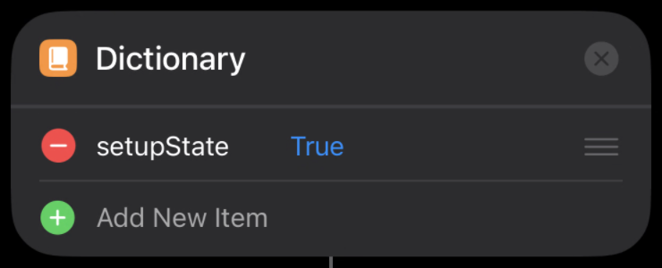
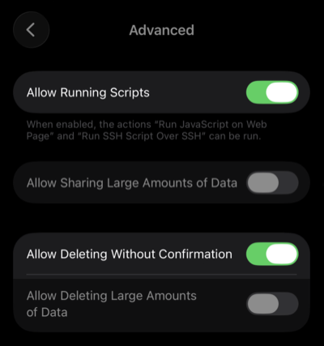
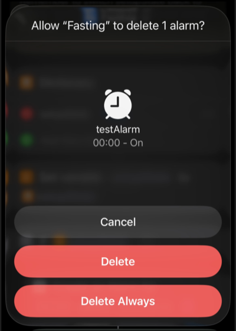
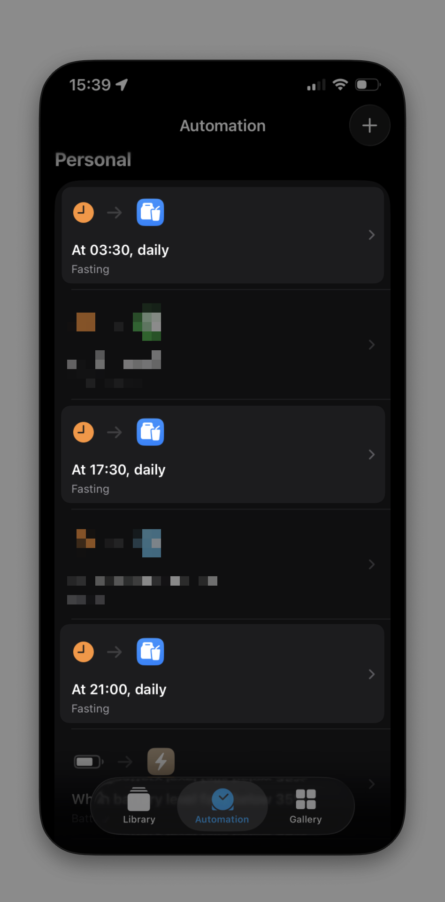

# Fasting Reminder

A comprehensive iOS shortcut that automatically notifies you at Suhoor and Iftar times based on your location and manages alarms accordingly — so you never miss a fast.

## Features

- **Automatic Prayer Time Fetching** — Retrieves accurate Suhoor and Iftar times using the [Al-Adhan API](https://aladhan.com) based on your location
- **Smart Alarm Management** — Automatically creates and deletes alarms for fasting times without manual intervention
- **Location-Based Accuracy** — Prayer times are calculated based on your current geographic location
- **Automation Support** — Runs silently in the background via iOS Shortcuts automations
- **Customizable Fast List** — Enable or disable specific fasts based on your observance

### Supported Fasts

| Fast                                                 | Type                    |
| ---------------------------------------------------- | ----------------------- |
| Ramadan (Full Month)                                 | Obligatory              |
| Ashura (10th Muharram)                               | Voluntary               |
| Days of Arafah (1st-9th Dhul Hijjah)                 | Voluntary               |
| Ayyam al-Beed (13th, 14th, 15th of each Hijri month) | Voluntary               |
| Mondays & Thursdays                                  | Voluntary               |
| Six Days of Shawwal                                  | Voluntary (Manual Mode) |

## Prerequisites

- **iOS 15 or later** (with Shortcuts app)
- **Internet connection** — Required for fetching prayer times from the Al-Adhan API
- **Scriptable** — A free app that enables advanced scripting capabilities for the shortcut

## Installation & Setup

### Step 1: Install Required Apps

- Download **[Scriptable](https://apps.apple.com/us/app/scriptable/id1405459188)** from the iOS App Store
- Download the **[Fasting Reminder Shortcut](https://github.com/iamrayyaann/fasting-ios-shortcut/blob/main/Fasting%20Reminder.shortcut)**

### Step 2: Initial Configuration

- Open the imported shortcut and scroll down to the **setup section**
- Set the value for **`setupState`** to **`True`**

   

- Navigate to **Settings > Apps > Shortcuts > Advanced** and enable:
   - **Allow Running Scripts**
   - **Allow Deleting Without Confirmation**
  
   

- Run the shortcut for the first time
- When the pop-up appears, tap **"Delete Always"** to grant the necessary permissions

   

- Set **`setupState`** back to **`False`**
   - *Optional:* Run the shortcut again to verify the pop-up no longer appears

### Step 3: Customize Your Fasts

- Scroll through the shortcut and locate the **list of Islamic fasts**
- Remove any fasts you do not observe (you can add them back anytime)

   

### Step 4: Set Up Automations

- Open the **Shortcuts** app and go to the **Automation** tab
- Create **three separate daily time-based automations**:

| Automation | Time Range | Purpose |
|------------|------------|---------|
| 1 | **2:00 AM – 4:00 AM** | Sets the Suhoor alarm |
| 2 | **4:00 PM – 6:00 PM** | Sets the Iftar alarm |
| 3 | **8:00 PM – 9:00 PM** | Deletes used alarms |

- For each automation:
    - Set it to **Run Immediately**
    - Toggle **off** "Notify When Run"
    - Set the action to run the **Fasting Reminder** shortcut

   

## Usage

Once configured, the shortcut runs automatically in the background. No daily interaction is required — alarms are created and deleted based on your fasting schedule.

### Manual Mode (Fast Everyday)

For voluntary fasts like the **Six Days of Shawwal** or other consecutive fasting periods:

1. Open the shortcut and set **`Fast Everyday`** to **`True`**
2. The shortcut will treat every day as a fasting day
3. **Remember** to set it back to **`False`** when you're done

## Known Limitations

| Issue                     | Description                                                                                                                                                    |
| ------------------------- | -------------------------------------------------------------------------------------------------------------------------------------------------------------- |
| **Shawwal Fasts**         | The Six Days of Shawwal are not automatically tracked since they can be observed on any six days during the month. Use **Fast Everyday** mode as a workaround. |
| **Scriptable Dependency** | The shortcut requires the Scriptable app to function.                                                                                                          |
| **Internet Required**     | Prayer times are fetched online; the shortcut will not work offline.                                                                                           |
| **Location Permissions** | The shortcut requires location access to fetch accurate prayer times for your area. |

## Contributing

Found a bug or have a feature request? Feel free to open an issue or submit a pull request.

## License

This project is open source and available under the [MIT License](LICENSE).
